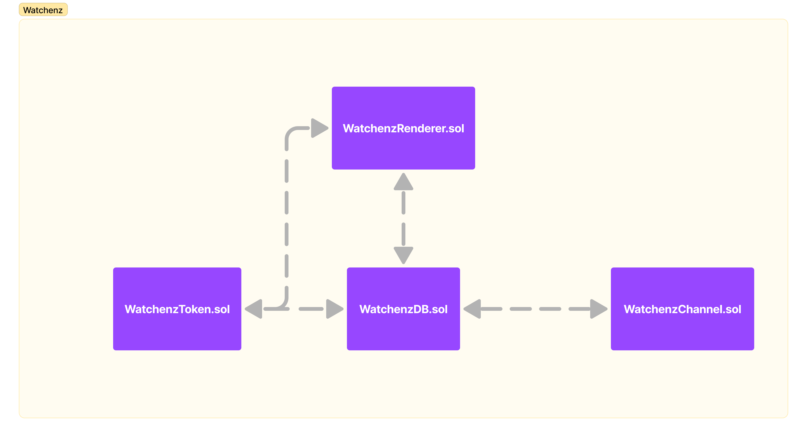

# Watchenz contracts

these are the watchenz contracts deployed on base blockchian.

---

| Contract                                         | Description                                                                                                                                                                                                                                                                                   | Address                                                                                                                    |
| ------------------------------------------------ | --------------------------------------------------------------------------------------------------------------------------------------------------------------------------------------------------------------------------------------------------------------------------------------------- | -------------------------------------------------------------------------------------------------------------------------- |
| [WatchenzToken](contracts/WatchenzToken.sol)     | This is the Watchenz ERC721 Token contract. It allows user to mint Watchenz. It returns `{tokenURI}` and it supports [ERC4906](https://eips.ethereum.org/EIPS/eip-4906) and would notify blockindexer when token metadata have been updated                                                   | [0xA9fa8aA90215fB4e009EBA9AE7F447EAeE887b95](https://basescan.org/address/0xA9fa8aA90215fB4e009EBA9AE7F447EAeE887b95#code) |
| [WatchenzRender](contracts/WatchenzRenderer.sol) | this is the metadata render smart contract for watchenz. it creates the svg for the watchenz and combine it with user setting from `WatchenzDB` to create costumizable parts of the watch like desired timeZone, dynamic background and dynamicDial.                                          | [0xD5A8Da62699650474827470C767967B32a6e5D64](https://basescan.org/address/0xD5A8Da62699650474827470C767967B32a6e5D64#code) |
| [WatcenzDB](contracts/WatchenzDB.sol)            | WatchenzDB is the contract that store user settings and provide it to `WatchenzRenderer` to create the token metadata, also when setting for a token gets updated it tell the `WatchenzToken` to emit `MetadataUpdate(uint256 _tokenId)` so blockchain indexer update the metada of the token | [0xaEeF782D583f0762022e5d1b5350162c0B2B3C1B](https://basescan.org/address/0xaEeF782D583f0762022e5d1b5350162c0B2B3C1B#code) |
| [WatchenzChannel](contracts/WatchenzChannel.sol) | the WatchenzChannel introduce a functionality for dev team to set a defualt dynamic background or dynamic dial for tokens that have not set their settings yet, it also introduce the possibility to create `WatchenzChannelV2` so others can create channel for themselves and others.       | [0xE50B597847C89d4021E4CEab8EAf6ceDf0BD21C5](https://basescan.org/address/0xE50B597847C89d4021E4CEab8EAf6ceDf0BD21C5#code) |

## Overview of the contracts

